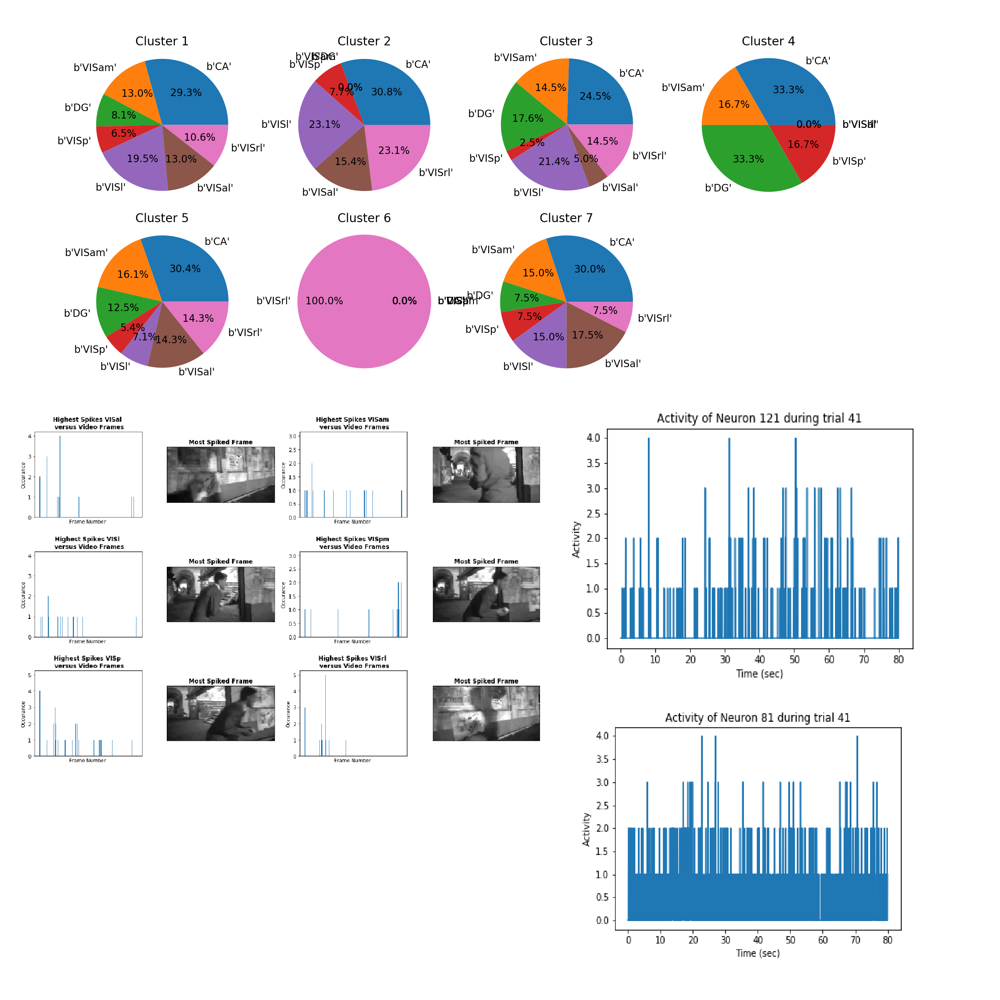
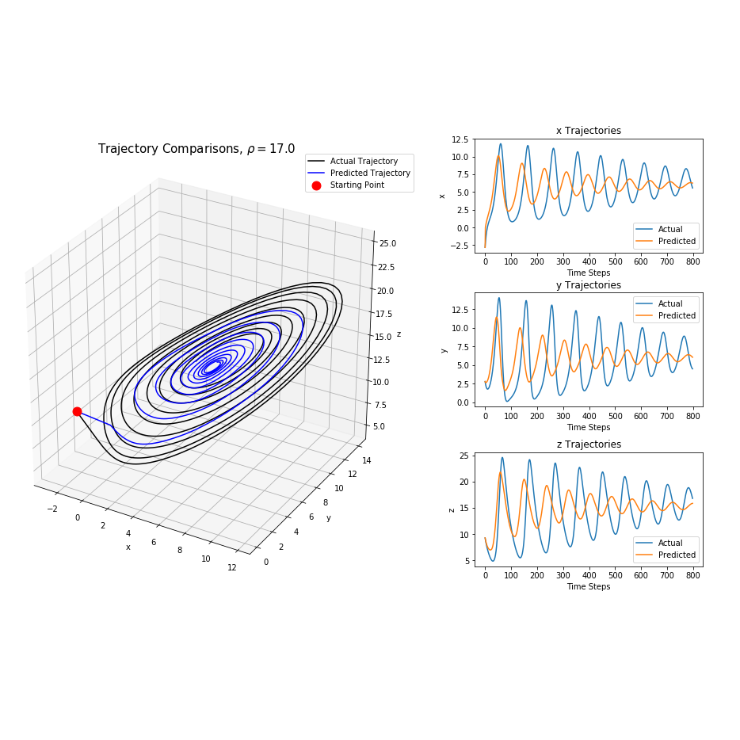

## Exploratory Analysis of Large-Scale Electrode Neural Recording”
  

An collaborative project that explores neural signal recored from repeated trials of lab rats watching a natural video. The signals are recorded using neural technologies such as Neuralpixels. Some topics we explore are: correlations between the signal and the region the signal originate from, low dimensional dynamics and the frequency patterns of the neural signals. 
 
Going more specifically into the the correlations between the neural signals and their originated region, two topics are explored. The first being the use of supervised and unsupervised machine learning techniques to classify the signals based on region. The goal is to see if the algorithms can determine a mapping that determine a mapping that correlates a signal's pattern and region. The second topic is to attempt to build a neural net using two different package that can recreate a signal based off the original visual stimulus. [note: update intro paragraph to reflect this second part]

 

## Taxi Tip Classification Capstone
   

A project that attempts to classify taxi tip data into three distinct groups: "low", "medium" and "high". The data set is a subset of New York taxi trips from Kaggle and contains various features such as trip time, trip length, payment method, among other things. This data set will also be supplemented by weather data from the National Centers for Environmental Information. 

The project explores which features have the largest impact on if a customer a customer gives a high tip. After exploring this, a classifier will be built that can determine if a trip will yield one of the three categories of tip. Experimenting with various different algorithms, the DecisionTree algorithm yielded the best  results, with an 92% accuracy. 
 

# Smaller Projects

#### Saving Fluffy the Dog
   

Looking at theoretical ultrasound data of a marble swallowed by a dog, we find that the signal is incredibly noisy. The goal is to parse through this noisy data and track the trajectory of the marble as it travels through the dog's digestive system. 

Using the Fourier Transformation and the method of averaging, we find that we can filter out some of the noise in the frequency domain which will translate once we tranform out of it. Afterwards,we can track the trajectory of the marble.

#### Video Stream Separations
   

Dynamic Mode Decomposition (DMD) allows one to separate a video into two different streams, a foreground stream and a background stream. Applying this technique on a variety of different videos, the goal is to explore what types of videos works best with this technique. 

 
 
 

#### Dynamic Systems Replication
  

Looking at a variety of different dynamical systems such as the Lorenz System, the Kuramoto-Sivishinky system and various diffusion reactions. Feeding these dynamical systems into a neural net, we will use neural nets to replicate the systems.